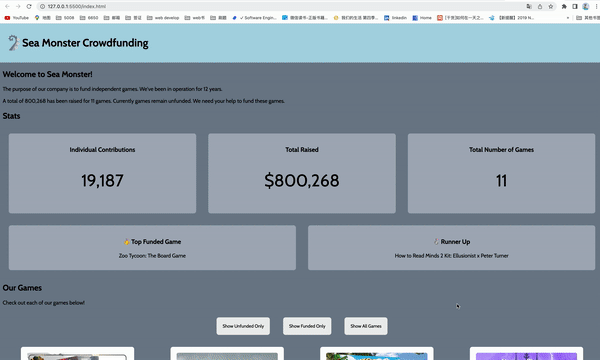

# WEB102 Prework - _Sea Monster Crowdfunding_

Submitted by: **Yuqin Luo**

**Sea Monster** is a website for the company Sea Monster Crowdfunding that displays information about the games they have funded.

Time spent: **7** hours spent in total

## Required Features

The following **required** functionality is completed:

- [x] The introduction section explains the background of the company and how many games remain unfunded.
- [x] The Stats section includes information about the total contributions and dollars raised as well as the top two most funded games.
- [x] The Our Games section initially displays all games funded by Sea Monster Crowdfunding
- [x] The Our Games section has three buttons that allow the user to display only unfunded games, only funded games, or all games.

The following **optional** features are implemented:

- [x] List anything else that you can get done to improve the app functionality!
  * We can set seperate pages for these buttons
  * Make those game card clickable
  * 

## Video Walkthrough

Here's a walkthrough of implemented features:

<!-- Replace this with whatever GIF tool you used! -->

GIF created with ezgif.com

<!-- Recommended tools:
[Kap](https://getkap.co/) for macOS
[ScreenToGif](https://www.screentogif.com/) for Windows
[peek](https://github.com/phw/peek) for Linux. -->

## Notes

Describe any challenges encountered while building the app.

It is well structured once you start. However, at the beginning, I am quite confused about the first secret key. I hope we can start directly from the challenge.

There are many way to achieve a specific thing, for example: make 800268 show 800.268. The truth is we can use other mathod instead of toLocaleString(). I hope there should be a more specific instruction on it.

